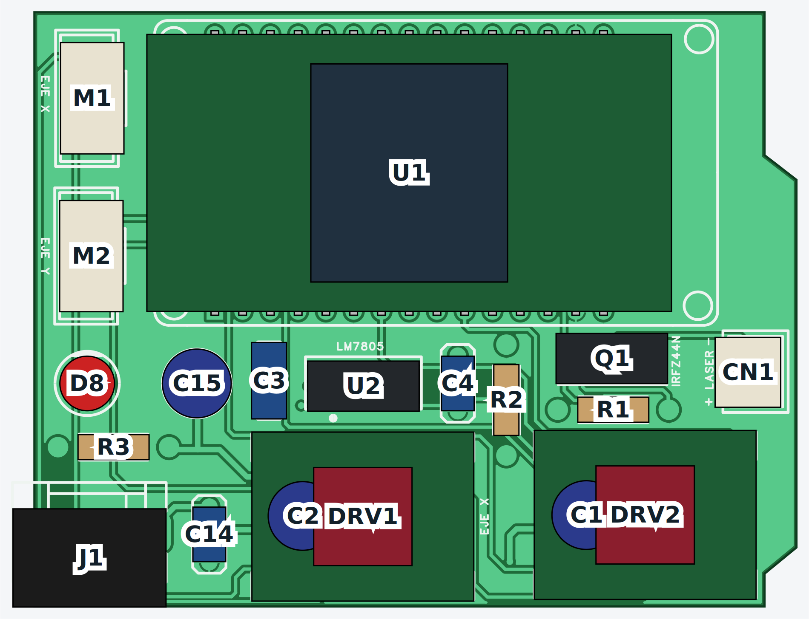
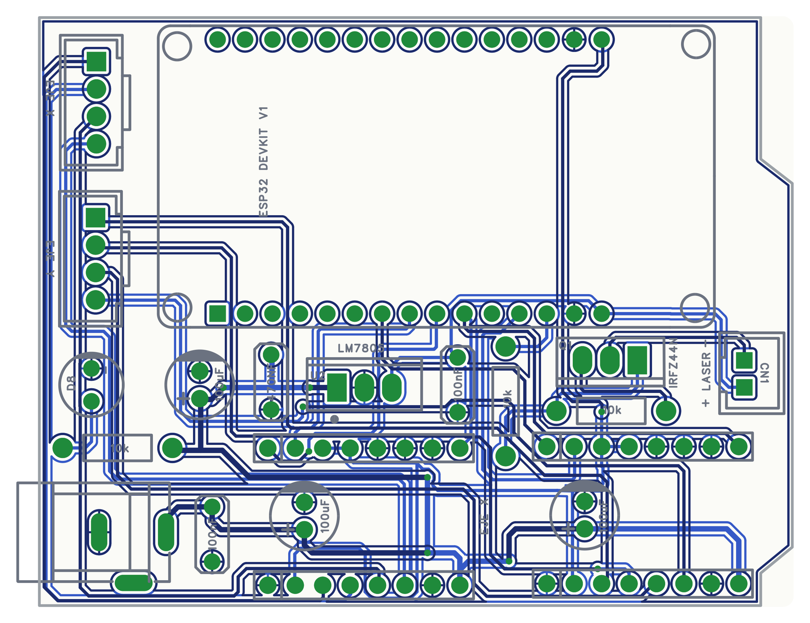
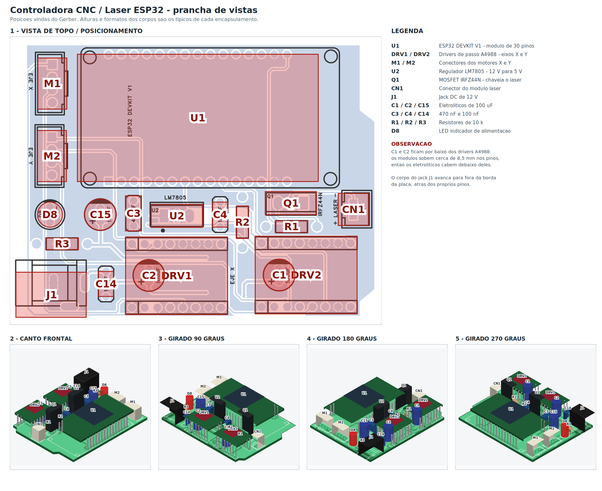
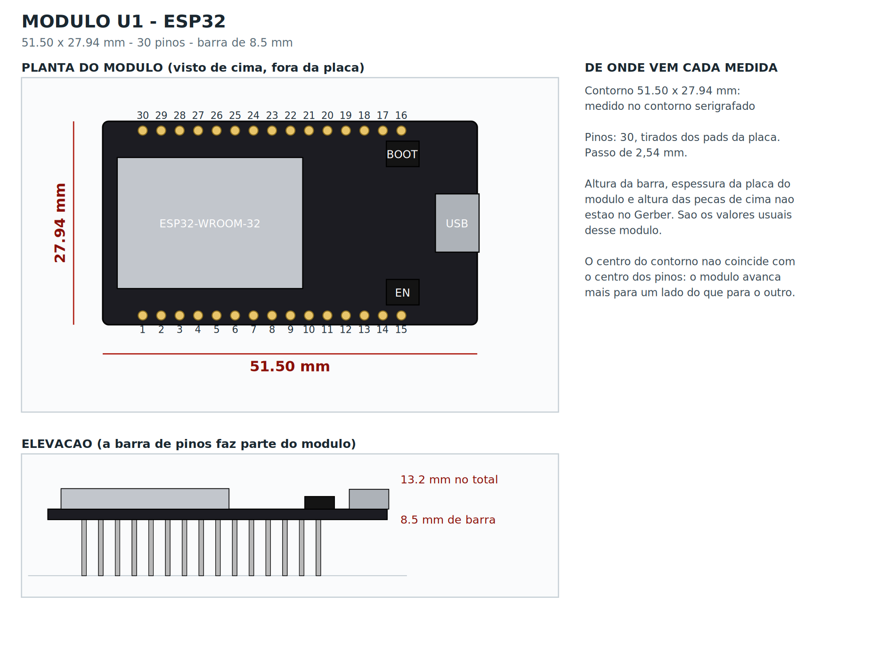
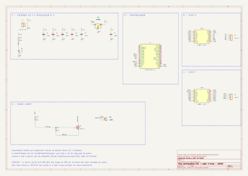

# Controladora CNC / Laser com ESP32

> ### ▶ [**Abrir o visualizador 3D interativo**](https://brigsd.github.io/Achievements/)
> Gire a placa, oculte as peças que quiser pelo menu lateral e **dê dois cliques
> em qualquer componente** para ver o que ele faz e em quais nets ele está ligado.

Este repositório é a **engenharia reversa completa de uma placa de circuito
impresso**, feita a partir do único material disponível: o pacote Gerber que se
manda para a fábrica.

A placa é uma **controladora de CNC / gravadora a laser de dois eixos**: um
módulo ESP32 comanda dois drivers de passo A4988 e chaveia um laser por um
MOSFET. São 70,5 × 54,6 mm, duas camadas, 19 componentes e 43 nets.

Partindo só do Gerber, foram reconstruídos:

| | |
|---|---|
| **Netlist** | Todas as 43 ligações, conferidas por dois métodos independentes |
| **Esquemático** | Projeto KiCad que abre e edita, gerado por script a partir da netlist |
| **Layout** | Desenho das trilhas, pads e serigrafia das duas faces |
| **Modelo 3D** | A placa montada, com cada peça posicionada pelo Gerber |
| **Visualizador** | A página interativa publicada no GitHub Pages |
| **Análise** | Como o circuito funciona — e um defeito que ele tem |

E, no meio do caminho, **dois problemas apareceram** — um elétrico e um
mecânico. Ambos estão em [`docs/analise.md`](docs/analise.md).

---

## O visualizador 3D

[](https://brigsd.github.io/Achievements/)

**→ [brigsd.github.io/Achievements](https://brigsd.github.io/Achievements/)**

- **Menu lateral** — liga e desliga cada peça, ou um grupo inteiro (Controle,
  Eixos, Alimentação, Laser). O botão *Placa* esconde a própria placa, o que
  deixa ver o que fica por baixo dos módulos.
- **Duplo clique numa peça** — abre para que ela serve, com a lista de
  pino → net daquele componente.
- **▲ vermelho** no menu marca as peças envolvidas no conflito de folga.

A página é estática e não depende de nada externo: o Three.js está versionado
em `web/`, junto com a geometria em `web/board.json`, que sai do mesmo modelo
que gera os desenhos impressos.

---

## Layout da placa



Trilhas da face superior em azul-escuro, da face inferior em azul-claro, pads em
verde e serigrafia em cinza. Os planos de terra ficam ocultos por padrão para as
trilhas aparecerem; `--pour` desenha eles em tom claro.

```bash
python3 tools/render_layout.py --split    # layout.svg, layout-top.svg, layout-bottom.svg
```

Também são gravados os `.png` correspondentes.

## Vistas 3D



Vista de topo com os corpos sobre a serigrafia (para conferir posicionamento) e
o mesmo conjunto visto de quatro ângulos.

```bash
python3 tools/render_3d.py --sheet --plan --views --steps
```

### Módulos como peças próprias



Os três módulos (ESP32 e os dois A4988) são modelados como peças em si: contorno
próprio, barra de pinos própria e o que fica em cima deles. O contorno do ESP32
**foi medido no desenho que a placa-mãe carrega na serigrafia** para ele —
51,50 × 27,94 mm, que é a medida real do DevKit V1, e cujo centro fica 2,5 mm
deslocado do centro dos pinos. `docs/modulos/` traz uma página por módulo.

Modelar os módulos direito fez aparecer um conflito mecânico: os eletrolíticos
C1 e C2 ficam debaixo dos drivers e, pelas alturas usuais, não passam no vão.
Ver [`docs/analise.md`](docs/analise.md).

### Conferência peça por peça

`--steps` grava `docs/posicionamento/`: uma página por peça, começando pela placa
nua. Cada página mostra a **placa sozinha mais uma única peça**, para conferir a
posição sem as outras atrapalhando — vista de topo sobre a serigrafia, uma
perspectiva, e as **quatro vistas laterais ortográficas** (frente, trás, esquerda,
direita), com a câmera na altura da placa. São **duas vistas de topo**: uma com a
peça sólida, como a placa montada se vê de cima, e outra em raio X sobre a
serigrafia, para conferir se o corpo cai em cima do próprio contorno. Nas laterais a altura sai verdadeira,
coisa que nenhuma vista isométrica dá. As demais peças ficam fantasmas em 12 %
só como referência.

Foi assim que apareceram os dois detalhes anotados na prancha: o eletrolítico
por baixo do driver A4988 e o corpo do jack passando da borda.

As **posições** de todas as peças saem do Gerber, tiradas do centro dos pads de
cada uma. As **alturas e formatos dos corpos não saem do Gerber** — um Gerber não
tem modelo 3D — então são as dimensões típicas de cada encapsulamento, listadas
em `BODIES` no script. O desenho serve para entender a placa, não para
verificação mecânica.

## Esquemático



## O que é a placa

Controladora de **CNC / gravadora a laser de 2 eixos**: um módulo ESP32 DEVKIT V1
comanda dois drivers de passo tipo A4988 (eixos X e Y) e chaveia um laser por um
MOSFET. Alimentação de 12 V com regulação para 5 V por LM7805.

70,5 × 54,6 mm · 2 camadas · 19 componentes · 43 nets

## Arquivos

| Caminho | Conteúdo |
|---------|----------|
| `hardware/esp32-cnc-laser.kicad_sch` | Esquemático KiCad (abre no KiCad 7+) |
| `hardware/esp32-cnc-laser.kicad_pro` | Projeto KiCad |
| `docs/board-views.svg` · `.png` | Prancha: topo + quatro ângulos |
| `docs/board-top.svg` · `.png` | Vista de topo com as peças sólidas |
| `docs/board-plan-check.*` | Vista de topo em raio X sobre a serigrafia |
| `docs/posicionamento/` | Uma página por peça: 2 topos, perspectiva e 4 laterais |
| `docs/modulos/` | Uma página por módulo, com as medidas e a pinagem |
| `docs/board-3d-000/090/180/270.*` | Cada ângulo separado |
| `docs/layout.svg` · `.png` | Desenho do layout (as duas faces) |
| `docs/layout-top.*` · `layout-bottom.*` | Layout de cada face separadamente |
| `docs/esp32-cnc-laser.svg` · `.pdf` | Esquemático renderizado |
| `docs/analise.md` | Como o circuito funciona e o que há de errado nele |
| `docs/bom.md` | Lista de materiais |
| `docs/netlist.md` | Tabela de todos os nets |
| `index.html` · `web/` | O visualizador 3D publicado no GitHub Pages |
| `gerber/` | Pacote Gerber original, que é a fonte de tudo |
| `tools/` | Scripts que geram e conferem o esquemático |

## De onde veio cada informação

**As conexões** vêm de `gerber/FlyingProbeTesting.json`, um arquivo do pacote
Gerber que lista o net de cada pad da placa. Nada de conectividade foi inferido.

**Os valores e part numbers** foram lidos da serigrafia
(`gerber/Gerber_TopSilkscreenLayer.GTO`), renderizada a partir do Gerber.

**A pinagem** dos módulos ESP32 e A4988 foi deduzida da netlist e confere com a
pinagem padrão desses módulos em todas as 30 e 16 ligações.

## Como isso foi verificado

O esquemático não é um desenho "que parece certo" — ele é conferido por duas
verificações automáticas:

```bash
python3 tools/verify_netlist.py   # esquemático  x  netlist da placa
python3 tools/check_copper.py     # geometria do cobre  x  netlist da placa
```

**`verify_netlist.py`** exporta a netlist do `.kicad_sch` com o `kicad-cli` e
compara net a net com a da placa. Resultado atual: **22 de 22 nets idênticos**,
sem sobra nem falta.

**`check_copper.py`** é independente do arquivo de netlist: rasteriza as duas
camadas de cobre usando as aberturas do próprio Gerber, rotula as ilhas de cobre
conectadas e une as faces nos furos metalizados e nas 9 vias. Ele só usa
coordenadas, nunca nomes de net. Resultado atual: **43 ilhas para os 43 nets, com
0 falsos cortes e 0 falsos curtos**.

## Um defeito encontrado na placa

O **source do Q1 (IRFZ44N) não chega ao GND** em nenhuma das duas camadas. O net
tem só dois pads: o pino 3 do Q1 e o pino 1 do R1. Sem esse retorno o MOSFET não
conduz e **o laser nunca acende**, independente do firmware.

Os dois métodos de verificação acima concordam nisso. Detalhes e as demais
observações de projeto em [`docs/analise.md`](docs/analise.md).

## Regenerar

Precisa de KiCad 7+ (`kicad-cli`) e das dependências em `requirements.txt`.

```bash
pip install -r requirements.txt

python3 tools/render_layout.py --split   # desenhos do layout
python3 tools/export_web.py         # dados do visualizador 3D
python3 tools/gen_schematic.py      # escreve hardware/esp32-cnc-laser.kicad_sch
python3 tools/gen_docs.py           # escreve docs/bom.md e docs/netlist.md
kicad-cli sch export svg --output docs hardware/esp32-cnc-laser.kicad_sch
kicad-cli sch export pdf --output docs/esp32-cnc-laser.pdf hardware/esp32-cnc-laser.kicad_sch
```

O esquemático é **gerado** a partir do Gerber, não desenhado à mão:
`gen_schematic.py` lê a netlist da placa e emite o `.kicad_sch`. Corrigir a placa
é mudar o Gerber e rodar de novo.
